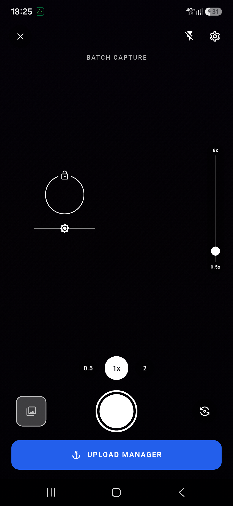
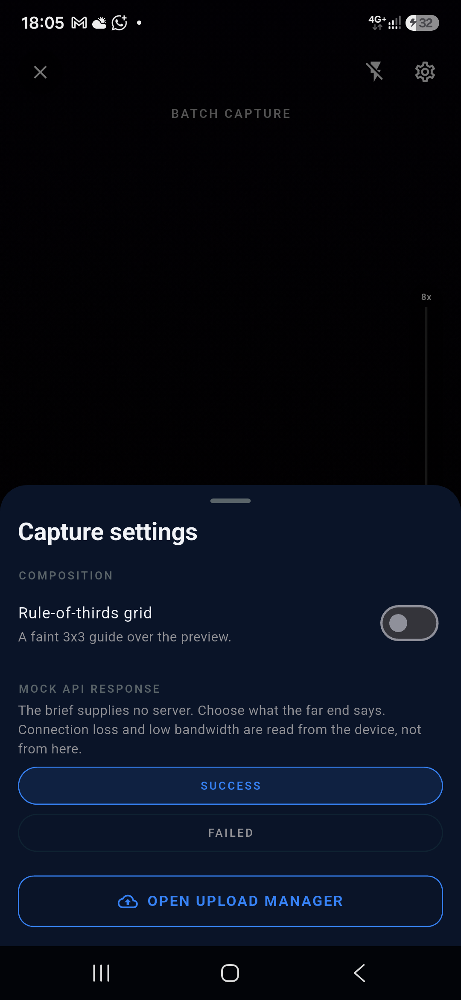
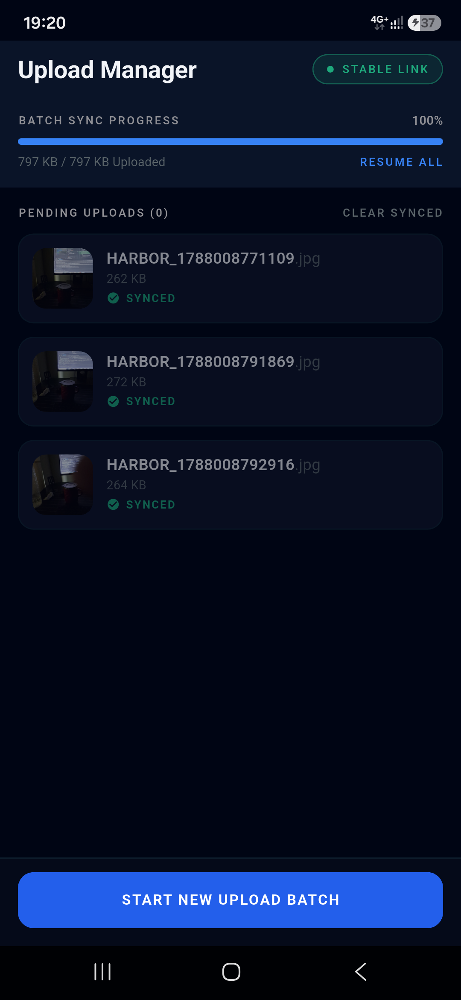

# ⚓ Anchorage

**A two-app field-operations suite: know where you are, never lose what you captured.**

Anchorage is one project containing two applications that share a name, a design language and an
architectural doctrine — and nothing else, because the brief asks for two genuinely
independent stacks.

| App | Stack | What it does |
| --- | --- | --- |
| **Anchorage Perimeter** | Native Android · Kotlin · Jetpack Compose · Kotlin Flow · Hilt | Anchors an office coordinate and lets a user mark attendance only from inside a 50 m geofence, with a live distance dial. |
| **Anchorage Harbor** | Flutter · Dart · BLoC · get_it | Custom camera with pinch/slider/lens zoom and tap-to-focus, batch capture, and a durable upload queue that survives no signal, low bandwidth, process death and reboot. |

### Why "Anchorage"?

An anchorage is a place a vessel can hold position safely. Both halves of this assessment
are the same idea in different clothing:

* **Perimeter** anchors you to a *place* — a fixed coordinate everything is measured against.
* **Harbor** anchors your *cargo* — captured evidence is held fast in a local queue and only
  released when it has genuinely reached shore.

The anchor even appears in the reference design: it is the icon on the "UPLOAD BATCH" button.

---

## Table of contents

1. [Repository layout](#repository-layout)
2. [Task 1 — Anchorage Perimeter (Native Android)](#task-1--anchorage-perimeter-native-android)
3. [Task 2 — Anchorage Harbor (Flutter)](#task-2--anchorage-harbor-flutter)
4. [Project structure and architectural approach](#project-structure-and-architectural-approach)
5. [Generative AI usage](#generative-ai-usage)
6. [How to run](#how-to-run)
7. [Testing](#testing)
8. [Screenshots](#screenshots)
9. [Further documentation](#further-documentation)

---

## Repository layout

```
Anchorage/
├── android/                     # Task 1 — Anchorage Perimeter (one Gradle module)
│   └── app/src/main/kotlin/com/anchorage/perimeter/
│       ├── presentation/        #   MVI ViewModels + Compose screens, navigation
│       ├── domain/              #   entities, policies, ports, use cases  (no Android types)
│       ├── data/                #   FusedLocation, DataStore, Room adapters
│       ├── di/                  #   Hilt modules: ports → adapters, use-case assembly
│       └── core/
│           ├── common/          #   Outcome<T>, AppError taxonomy, dispatchers
│           └── designsystem/    #   colour/type/shape tokens + shared composables
│
├── flutter/                     # Task 2 — Anchorage Harbor (same layers, Dart idiom)
│   └── lib/
│       ├── app/                 #   shell, routes
│       ├── di/                  #   get_it composition root
│       ├── background/          #   WorkManager isolate entry point
│       ├── presentation/        #   capture/ and sync/: Blocs, pages, widgets
│       ├── domain/              #   entities, policies, ports, use cases  (no plugins)
│       ├── data/                #   camera, SQLite queue, connectivity, schedulers
│       └── core/                #   Failure taxonomy, Result<T>, design tokens
│
├── docs/                        # feature-by-feature and cross-cutting documentation
├── design/                      # reference screenshots from the brief
├── CLAUDE.md                    # working agreement for AI assistants on this repo
├── PROMPTS.md                   # every prompt used to build this project
├── IMPROVEMENTS.md              # what was added beyond the brief, and why
└── README.md                    # you are here
```

---

## Task 1 — Anchorage Perimeter (Native Android)

A single `AttendanceScreen` that handles both setup and check-in, exactly as the brief
requires.

### What the brief asked for, and where it lives

| Requirement | Implementation |
| --- | --- |
| Button to "Set Office Location" that fetches GPS and saves locally | `OfficePickerRoute` — a map with a draggable perimeter, seeded by `CaptureOfficeAnchorUseCase`’s fix and confirmed by `PlaceOfficeAnchorUseCase` → `OfficeAnchorLocalSource` (DataStore) |
| "Mark Attendance" enabled only within 50 m | `GeofenceEvaluator` + `AttendanceStatus.canMarkAttendance`; re-validated authoritatively in `MarkAttendanceUseCase` |
| Real-time distance indicator | `DistanceDial` fed by `ObserveAttendanceStatusUseCase` — re-measures the moment the office moves, without waiting for the next GPS tick, and animates rather than twitching. See [The distance updates reactively](#the-distance-updates-reactively-and-it-does-not-twitch) |
| Jetpack Compose UI matching the screenshot | `AttendanceScreen.kt` + `core/designsystem/` |
| Kotlin Flow state management | Every read path is a `Flow`; the ViewModel exposes `StateFlow<AttendanceUiState>` |
| Graceful permission and hardware failure handling | `AppError.Location` taxonomy → `AttendanceNotice` → inline banner with a remedy |

### The screen, state by state

* **No office anchored** — the dial reads `--`, the pill reads `OFFICE NOT SET`, the
  check-in panel is locked, and the card's status dot is grey.
* **Out of range** — red arc proportional to `distance / 50 m`, `120m` in the centre,
  `OUT OF RANGE` pill, and the instruction *"Move within 50 meters of the designated office
  location to enable check-in."*
* **In range** — the arc, pill and padlock all turn green/blue together and the button
  becomes pressable.
* **Weak signal** — a fix whose own error radius is wider than the fence is reported as
  `WEAK SIGNAL` in amber, not as a false "in range". See
  [Improvement #2](IMPROVEMENTS.md).
* **Already marked today** — green `CHECKED IN` pill with the time and distance of the
  recorded check-in.
* **Window closed** — the caption under the button flips from `AVAILABLE 09:00 AM - 10:30 AM`
  to `WINDOW CLOSED`, in amber.

### Why the live distance is coroutines, and not WorkManager

The obvious question for anything that updates by itself on Android, and the answer is not
close. **WorkManager is the wrong tool for this and cannot do the job at all.**

| | Kotlin Flow over `FusedLocationProviderClient` | WorkManager |
| --- | --- | --- |
| Update cadence | Whatever the request asks for — here **2 seconds** | Periodic work has a **15-minute minimum**, and the OS may delay it further |
| Purpose | Live UI on a screen the user is looking at | Deferrable work that must survive process death |
| Lifecycle | Bound to the screen; stops when it stops | Deliberately *outlives* the app, which is the opposite of what is wanted |
| Cost of misuse | — | A "real-time" indicator that refreshes a quarter of an hour after you have walked away |

A distance read-out is the textbook case *for* a hot stream and *against* a job scheduler: it
is only interesting while someone is watching it, it must be immediate, and it must stop the
instant they stop watching. WorkManager exists for the opposite shape of problem — the Flutter
app uses it for exactly that, to drain the upload queue when the app is closed.

So the chain is a plain coroutine one, and every link is cancellable:

```
FusedLocationProviderClient
  └─ callbackFlow          PRIORITY_HIGH_ACCURACY, 2 s interval, no distance filter,
     │                     seeded from the platform's last known fix so the dial reads
     │                     immediately rather than after the first satellite reply
     └─ combine            with the saved anchor and today's record
        └─ scan            carries the last fix forward for hysteresis and re-anchoring
           └─ StateFlow    collected by Compose with `collectAsStateWithLifecycle`
```

`awaitClose { removeLocationUpdates(callback) }` is what makes cancellation real: stopping
the collection genuinely unregisters the receiver rather than merely dropping its output.

**One bug worth recording here**, because it is invisible in code review and intermittent on
a device. Registration used the `Looper` overload with `null`, which means *"deliver on the
calling thread's Looper"* — and the `callbackFlow` block runs on `dispatchers.io`, a pool
thread that has no Looper at all. Play Services then throws while wiring up the callback, the
stream ends before a single update arrives, and the screen sits on `LOCATING` having
effectively asked for nothing. It now registers with an **`Executor`**, which has no Looper
requirement, and the registration call catches `Throwable` rather than only
`SecurityException` — what comes back from Play Services across the long tail of Android
devices is not all one exception type, and this class's contract is that it never throws.

### The distance updates reactively, and it does not twitch

The brief asks for a *real-time* distance indicator, and "real-time" is where this screen is
easiest to get subtly wrong. Three things had to be true at once.

**It re-measures the instant the office moves, not on the next GPS tick.**
`ObserveAttendanceStatusUseCase` fuses three sources — the saved anchor, the position stream
and today's record — and threads the **last known fix** forward through a `scan`, rather than
the last finished reading. That distinction is the feature: a *reading* is an answer about
one particular office, so reusing it after the office moves reports the distance to a
building the user no longer works in. A *fix* is raw enough to still be true, so the moment
the anchor changes it can be measured again against the new one. Press "Set Office Location"
and the dial goes to `0m` immediately, instead of showing `--` (or the old distance) for the
several seconds until a satellite next answers. Two tests cover exactly this.

**Nothing on screen jumps.** The ring is tweened over 450 ms, because raw GPS jitters by a
few metres a second and a bare threshold makes the arc visibly twitch. The number in the
middle of it was *not* tweened, so the ring glided while the read-out flickered 120 → 118 →
121 underneath it — which reads as a broken sensor rather than a live one. It now animates on
the same curve and duration, so the two move as one thing. The *value* is animated and then
formatted, rather than animating a formatted string, which keeps the `m` / `km` switch in one
place; the accessibility announcement deliberately uses the real number rather than whichever
frame the tween is on.

**The card grows smoothly.** Anchoring an office adds a whole row to the office card, and
swapping the button for a spinner changes its height again. Appearing instantly made the card
— and everything below it — lurch. One `animateContentSize()` on the card smooths every size
change it can make.

**Hysteresis is applied to the dial only.** Entry at 50 m, exit at 58 m, so a user standing on
the boundary does not watch the pill strobe between states. The check-in itself uses the true
50 m with no forgiveness — the display is allowed to be kind, the decision is not.

### Battery, memory and the things that crash on other people's phones

**The GPS stops when the screen does.** This was a real bug, and the most expensive kind: the
position stream was gated on *permission* alone, and `viewModelScope` outlives visibility, so
opening Attendance and pressing home left the receiver running at the full update interval,
indefinitely, for a reading nobody could see. Permission and visibility are different
questions — the app may read the position, versus it has any reason to — and the stream now
runs only while both are true. `repeatOnLifecycle(RESUMED)` cancelling its block is the signal
that the screen has gone; a test asserts the collector count drops to zero.

**Stopping the stream must not lose the position.** These two are one change, and shipping
the first without the second is what made the screen blink: returning from the office picker
tore down the observation and started a fresh one carrying nothing, so the dial dropped to
`--` (or sat on `LOCATING`) and then *jumped* to the new distance when a satellite next
answered — at exactly the moment the user had moved their office and was watching to see
whether it had worked. The last fix is now handed back into the new subscription, so the new
anchor is measured against it in the first frame and the dial animates from the old number to
the new one instead of via nothing.

**Nothing outlives the screen.** `FusedLocationTracker` is a `callbackFlow` whose `awaitClose`
removes the location callback, so cancellation genuinely unregisters the receiver rather than
merely stopping delivery. The ViewModel cancels its observation job in `onCleared`.

**Text can grow.** Buttons hold a *minimum* height rather than a fixed one. At a large system
text scale a fixed box crops its own label, which is the one failure a button cannot afford,
and the whole screen scrolls so a short phone loses nothing off the bottom.

**Permission is asked for, not advertised.** The screen opens the *system* dialog on entry
rather than drawing a banner that offers to open it — one fewer tap in the common case, and
one fewer thing to read. The guard matters: `repeatOnLifecycle` re-delivers the permission
state on every resume and **the permission dialog itself pauses the activity**, so a request
driven straight off "not granted" would re-open itself the instant the user declined it,
forever. It asks once per visit, and a genuine departure re-arms it — so declining is not a
one-way door, while Android’s own escalation to "don’t ask again" hands over to the Settings
banner.

**Failures are values, and every one of them has a remedy on screen:**

| Condition | What the user sees | What they can do about it |
| --- | --- | --- |
| Permission never asked | *Nothing.* The **system dialog** opens on entry | Answer it. An in-app banner whose only job is to summon the real dialog is a dialog about a dialog |
| Declined, but Android will still ask | The dial caption reads `NO ACCESS` and says why | Leave the screen and come back — that re-arms the request |
| Permission blocked forever | `Location access is blocked` | **Open settings** — the one permission state that still earns a banner: the system dialog genuinely cannot help, and an app that does not say so is a dead end |
| Location services switched off | `Location is switched off` | **Open location settings** |
| No position available | *Nothing.* The dial holds the last known distance and the stream recovers by itself | Nothing to do — a banner here interrupted a screen that was still correct, to offer a Retry that changed nothing |
| Fix too coarse to anchor | The measured accuracy, and the accuracy required | **Try again** |
| Fix too coarse to trust | `WEAK SIGNAL` in amber, button stays locked | Wait — reporting a false "in range" would be worse |
| Mock location provider | Reported, **not blocked** | Nothing — every emulator reports mocked fixes, and blocking makes the app untestable on the device most reviewers use |
| Storage failure | `Could not read saved office` | **Retry** |
| Map tiles unreachable | The picker falls back to a plain grid | Nothing — imagery is decoration, and the picker must work on a plane |

`FusedLocationTracker` and `OsmTileSource` both carry an explicit **"this class never throws"**
contract: every `SecurityException`, timeout, DNS failure and dead-provider result is
translated into a typed `AppError` at the boundary and returned as a value. The only outbound
network call in the Android app is the office picker's map tiles, and it is not load-bearing.

### Stack

Kotlin 2.2.21 · AGP 8.13.2 · Gradle 8.14.3 · Compose BOM 2025.12.01 · Hilt 2.57.2 ·
Room 2.8.4 · DataStore 1.1.7 · Play Services Location 21.4.0 · minSdk 26 · targetSdk 36

---

## Task 2 — Anchorage Harbor (Flutter)

Two screens: `CameraPreviewPage` and `UploadManagerPage`.

### What the brief asked for, and where it lives

| Requirement | Implementation |
| --- | --- |
| Custom camera preview screen | `CameraPreviewPage` — full-bleed preview with floating chrome |
| Pinch-to-zoom | `CameraPinchStarted` / `CameraPinchZoomed`, anchored to the zoom the gesture began at |
| Zoom slider | `VerticalZoomSlider` — hand-built, because a rotated Material `Slider` inverts its own drag axis |
| Rounded zoom buttons (0.5x, 1x, 2x) | `ZoomStopSelector` over the `ZoomLadder` policy — see [Why the zoom buttons are ratios, not cameras](#why-the-zoom-buttons-are-ratios-not-cameras) |
| Tap-to-focus with a visual indicator | `CameraFocusRequested` → `FocusReticle` — a ring cut at twelve o'clock with an AE/AF padlock sitting in the gap, plus a brightness slider. Shown optimistically and cleared on a dwell timer. The tap is mapped through `PreviewCrop` first — see [Where a tap actually lands](#where-a-tap-actually-lands) |
| Batch capture with a "Pending Uploads" list | `CaptureBatch` → `BatchReviewSheet` → `EnqueueBatch` → `UploadManagerPage` |
| Background worker monitoring connectivity | `WorkManagerScheduler` + `syncCallbackDispatcher` |
| Images stay queued on failure | SQLite-backed `UploadQueueRepositoryImpl`; nothing leaves the queue until the server acknowledges it |
| Automatic retry on a stable connection, no user action | `ConnectivityMonitor` (with a settle window) → `UploadManagerBloc` → `ProcessUploadQueue`. Six triggers, not one — see [What actually starts a sweep](#what-actually-starts-a-sweep) |
| Low bandwidth handled, not just "offline" | `BandwidthPolicy` — throughput is **measured** from the bytes moving, because the OS reports a transport and never a speed |
| No API available — mock success and failure | `MockUploadApi` (working transport) + `http_upload_api.dart` (real transport, fully written and commented out) |

### The camera screen, control by control

Read top to bottom, exactly as the reference design is laid out.

| Control | Behaviour |
| --- | --- |
| **✕**, top left | Asks before closing the app — see [Closing the app](#closing-the-app). It used to call `maybePop`, which on the root route pops nothing: the button did nothing at all. |
| **Flash**, top right | Cycles off → auto → on → torch. The *glyph* changes with the mode, so the state is never carried by colour alone. The torch has an idle deadline so a pocketed phone does not cook its own LED. |
| **⚙**, top right | Opens `CameraSettingsSheet`: a rule-of-thirds grid, the mock-transport switch, and a route to the Upload Manager. Flash is deliberately absent — it lives on the top bar, and one setting with two controls is one control too many. |
| **Viewfinder** | Tap to focus *and* meter exposure — tapping a dark corner and getting a sharp but unreadable frame is not what the gesture means. Pinch to zoom, anchored to where the gesture started. See [The focus reticle](#the-focus-reticle-lock-and-brightness). |
| **Vertical slider**, right edge | Absolute zoom across the offered band, labelled at both ends, and the band spans **every rear camera** rather than the open one. Drag up zooms in. |
| **0.5 / 1 / 2**, above the shutter | Quick zoom. The selected pill reads the *live* value (`1.7x`) whenever the zoom sits between stops. |
| **Thumbnail + badge**, bottom left | Opens `BatchReviewSheet` — the shots that have **not** been handed over yet, where a blurred frame can still be dropped for free. With an empty batch it goes to the Upload Manager instead. |
| **Shutter** | One photograph per completed capture; the event is `droppable`, so hammering the button cannot queue twelve. |
| **Flip**, bottom right | Front ⇄ rear. |
| **UPLOAD BATCH (n)** | Hands the batch to the sync engine and starts a fresh one, confirmed by a toast across the **top** of the screen — `SnackBar` only anchors to the bottom, and on a camera the bottom edge is the shutter the user is about to press again. With nothing captured it reads `UPLOAD MANAGER` and goes there, rather than sitting grey through the whole of a first run. |

The thumbnail, shutter and lens-flip button share one centre line, and the shutter is centred
on the screen rather than merely spaced evenly between two neighbours of different widths.

#### The focus reticle: lock and brightness

Tapping the viewfinder does not just focus. It places a reticle modelled on the platform
camera apps — the familiarity *is* the feature, because nobody reads a manual for a
viewfinder:

* **A ring** marks where the sensor is metering, **cut at twelve o'clock** for the padlock to
  sit in. Every platform camera app cuts the ring rather than drawing the lock on top of the
  line, and the reason is legibility: a stroke running through the middle of a padlock reads
  as a broken circle with something stuck to it, not as a badge on a ring. The gap is derived
  from the glyph rather than typed in, so the two cannot drift apart. The ring is
  non-interactive, so a tap inside it re-meters there rather than being swallowed.
* **A padlock** in that gap holds focus *and* exposure. Open by default, closed while locked.
  The two are locked together on purpose: every camera app presents this as one control,
  because the situation it exists for is one situation — *I have framed this, stop changing
  it.* A lens switch clears the lock, because `selectLens` disposes the controller and a
  fresh one starts at auto metering — a closed padlock over a sensor that is metering freely
  tells the user something untrue.
* **A brightness slider** beneath — a sun on a track — sets exposure compensation for this
  metering point.

Three rules make it behave the way people expect:

1. **A locked reticle does not fade.** The dwell timer is cancelled while the padlock is
   closed. A lock the user cannot see is a lock they forget they set, and every photograph
   afterwards is metered for a subject they walked away from.
2. **A tap elsewhere is a new metering decision.** It releases the lock and returns the
   brightness to neutral, because both belonged to the old point.
3. **Nothing survives invisibly.** When the reticle fades, the exposure goes back to 0 EV —
   and releasing the sensor drops the lock with it, because a new controller starts at auto.

Exposure compensation is reported by Android in *steps* (commonly ±2 EV in thirds), and a
value off that grid is rejected or silently rounded. `ExposureRange` snaps every value before
anything else sees it, so the sun and the sensor can never disagree about where it is.

#### Closing the app

The camera is the app's root route, so the ✕ and the system back gesture both mean "close
Anchorage Harbor", not "pop a screen". Both go through one confirmation, and it is not a
generic *are you sure*: it says what closing actually costs.

Photographs live in the working batch from the moment the shutter fires until **UPLOAD
BATCH** hands them to the queue, and only the queue is durable. So when the batch is empty
the dialog says the queue keeps syncing in the background and offers **CLOSE** / **CANCEL**.
When it is not, it names the count and adds **UPLOAD & CLOSE**, which enqueues first and
closes second — and does not close at all if the enqueue fails, because closing then would do
exactly the thing the user chose to avoid. Backing out of the dialog counts as *stay*.

The app closes with `SystemNavigator.pop()`, not `exit(0)`: it asks the platform to finish
the activity so Flutter and the plugins shut down in order. Killing the process outright is
how a half-written SQLite transaction becomes a corrupted queue.

#### Where a tap actually lands

The preview is painted to **cover** the screen, which means a tap and the point it names on
the sensor are *not the same point*. A 3:4 preview covering a 9:20 phone is half again too
wide, so about 40% of the sensor's width never reaches the glass. Handing viewport
coordinates to `setFocusPoint` focuses somewhere the user did not touch, and the error grows
the further from centre they tap — on a tall phone, that is most of the frame.

`PreviewCrop` maps the tap **in** to sensor space and the reticle back **out** again, and the
round trip is asserted to be exact, because the ring has to land under the finger. When the
controller has not reported a preview size yet the crop degrades to the identity rather than
guessing: a fabricated shape would map taps confidently and wrongly.

The order of the platform calls matters just as much. `setFocusMode` goes **first** (a sensor
left locked by a previous tap drops a new point, and CameraX treats a mode change as "cancel
the run in progress"), then exposure, then focus — so the focus run is the one left standing.

#### The zoom band: 0.5x – 8x, across every camera

"Zoom" means two different numbers, and conflating them is what put a **1x – 8x** slider on a
phone whose camera app offers 0.5x:

* **Sensor zoom** is what `setZoomLevel` takes. On a Galaxy A54 *every* camera reports
  1.0 – 8.0 for it, the ultra-wide included — on that sensor 1.0 already **is** the wide view.
* **Effective zoom** is what the user means by "0.5x": the field of view relative to the main
  camera. It is the lens's own factor multiplied by its sensor zoom.

Everything the user touches — the slider, its end labels, the quick-zoom pills — is in
effective zoom, and `ZoomSpan` is the one place that converts back. It is also the only thing
that decides another camera has to be opened.

* **The 8x ceiling is a product decision.** Plenty of phones report 10x or 30x; past roughly
  8x they are upscaling, not zooming. Those extra numbers also cost something real — mapping
  1x–30x onto the reference design's ~230 dp slider makes the 1x–3x band people actually use
  about twenty pixels tall.
* **The 0.5x floor is the hardware's to grant**, but "the hardware" means the *device*, not
  the sensor that happens to be open. Where the ultra-wide is published as a separate camera,
  reaching 0.5x means opening it.

##### Opening another camera without the screen flashing

Opening a sensor blanks the preview for a few hundred milliseconds. A pinch emits dozens of
values a second, so acting on every one that crossed 1.0x reopened the camera over and over —
and because the zoom handlers are `restartable`, a `selectLens` could be torn down half way,
leaving the app with no camera and a spinner. Three rules fixed it:

1. **A hand-over never happens mid-gesture.** While a pinch or a slider drag is in flight the
   zoom travels as far as the open camera honestly can, and the value the finger actually
   asked for is remembered. The camera opens once, when the fingers lift — with a settle
   timer as a backstop for gestures the system cancels without an end event. A tap on a pill
   is a decision rather than a drag, and does not wait.
2. **The switch is its own `sequential` event.** `CameraZoomHandoverRequested` cannot be
   cancelled by the next pinch value.
3. **A rear-to-rear hand-over is not a cold start.** `isSwitchingLens` keeps the full-screen
   loading state off the chrome for it.

`ZoomSpan` also holds two rules worth stating outright. It switches *wider* automatically but
never *longer*: a rear camera's role is inferred from the order the platform lists it in, and
on this very phone the third rear camera is a **macro** that the inference calls a 2x
telephoto. And the front camera is a span of one — it is not on the rear ladder, and a pinch
on a selfie must never open a camera pointing the other way.

#### Why the zoom buttons are ratios, not cameras

The obvious implementation of "0.5x / 1x / 2x" is one button per rear camera. It is also
wrong on nearly every Android phone, and it was the first thing fixed in this pass.

`availableCameras()` reports *logical* cameras. A phone with an ultra-wide, a main and a
telephoto typically publishes **one** rear camera whose zoom range spans all three; the
platform switches the physical sensor underneath as the zoom crosses a threshold. Building
the row from that list therefore produced a single pill — and the code then hid the row
entirely, because one pill that does nothing is worse than none. On the device a reviewer
actually holds, the reference design's most recognisable control rendered as empty space.

`ZoomLadder` builds the row from the sensor's real zoom range instead:

* 1x is always offered — it is the frame the user is looking at.
* A wide button appears only when the minimum is genuinely below 1x, and it targets that
  exact minimum, so a 0.6x ultra-wide is honestly labelled `0.6` and lands where the
  hardware stops rather than being silently clamped.
* 2x, 3x, 5x, 10x are offered only up to what the sensor reaches. Three buttons, as in the
  reference.
* For the minority of devices that publish each rear sensor separately, tapping a ratio the
  open camera cannot reach opens the rear camera that can, then sets the zoom.

### The Upload Manager, control by control

| Control | Behaviour |
| --- | --- |
| **Title row** | The screen name and the link chip — three states, not two, because "connected" and "usable" are different answers. A small spinner appears while a sweep is running. **No back arrow:** the system back gesture already leaves the screen and the bottom of the page carries the way back to the camera, so a second, weaker exit in the corner was two answers to one question. |
| **Batch sync progress** | Byte-weighted, so a 4 MB file does not count the same as a 200 KB one. `PAUSE ALL` holds everything that exists when it is tapped; `RESUME ALL` releases it **and** re-arms any row that had given up. |
| **Pending uploads** | One row per queued photograph, each naming its own state in the reference's own words — `IN QUEUE`, `UPLOADING - 45%`, `WAITING FOR CONNECTION`, `RETRYING... (ATTEMPT 2/3)`, `SYNCED`, `FAILED`. A parked row says what it is waiting for. Per-row retry and discard sit behind the row itself. |
| **CLEAR SYNCED** | Housekeeping — forgets the delivered rows only. |
| **START NEW UPLOAD BATCH** | Back to the camera, which is what someone finished with this screen actually wants. |

Opening this screen re-arms every recoverable failure and sweeps, so a queue that gave up
while the cause was being fixed does not need a row-by-row retry.

### The sync engine in six rules

`ProcessUploadQueue` is the heart of the app. Every rule below has a test that fails if the
rule is removed.

1. **Never start without a stable link.** Offline or unsettled? Every task is parked in
   `waitingForConnection` *without spending an attempt*, and a network-constrained wake-up
   is requested from the OS.
2. **One task at a time.** Parallel uploads on a weak link starve each other.
3. **Connectivity failures do not consume attempts.** Losing signal is a pause, not a
   failure. Only real transport or server errors increment the counter. That includes a link
   that is **up but too slow to be useful** — see [Low bandwidth is measured, not
   scripted](#low-bandwidth-is-measured-not-scripted).
4. **Unretryable failures stop immediately.** A missing file fails once and is shown to the
   user rather than looped. The budget is **3 attempts**, and it is only ever spent on
   failures that were the task's own — by the third identical rejection, the fourth is not
   going to be the one that works.
5. **The queue is the source of truth throughout.** Every transition is written before the
   next task starts, so process death mid-sweep loses at most one in-flight transfer.
6. **A task is claimed before it is uploaded.** Two sweeps genuinely race — the Bloc sweeps
   in the foreground the moment the link steadies, and WorkManager sweeps from a separate
   isolate with its own object graph, so neither can see the other's in-flight guard. The
   claim is a single conditional `UPDATE`; exactly one sweep wins the row. The mirror-image
   hazard — a process killed *holding* a claim, leaving a row stuck in `uploading`, which is
   not an eligible state — is undone by a lease: anything claimed longer than ten minutes ago
   with no progress is returned to the queue at the top of the next sweep. Without both
   halves the queue either sends a file twice or strands it forever.

### What actually starts a sweep

The rules above say what a sweep *does*. Equally important is when one begins, because an
engine that is correct but only runs every fifteen minutes looks broken:

| Trigger | Where |
| --- | --- |
| App launch | `UploadManagerBloc` — drains a queue left behind by a previous run |
| **The link becomes stable** | `UploadManagerBloc` — the brief's requirement in one line: no button, no user action |
| **New work is queued** | `UploadManagerBloc` — tapping `UPLOAD BATCH` on an already-stable link used to upload nothing until WorkManager next woke; the rows just sat at `IN QUEUE` |
| **A backoff elapses** | `UploadManagerBloc` — a retry scheduled four seconds out had no foreground trigger at all, so the row read `RETRYING...` and then did nothing for fifteen minutes |
| **Work is parked and the link says it is usable** | `UploadManagerBloc` — "the link became stable" is a *transition*, and a weak signal that reports itself connected the whole time never produces one. The row sat at `WAITING FOR CONNECTION` on a phone with four bars. Backs off from 20 s to a 5-minute ceiling while nothing gets through, so a captive portal cannot keep the phone warm |
| **The Upload Manager is opened** | `UploadManagerOpened` — and this one also **re-arms the rows that had given up** |
| OS wake-up, app closed | `WorkManagerScheduler` — a one-shot constrained to `NetworkType.connected`, plus a 15-minute periodic safety net |

Only the first two existed at first. The rest are what make the engine look as resilient as
it is, and each has a test that fails without it. Two needed a matching fix underneath:
`claim` and `requeueStalled` now republish the queue **only when they change it**, because
the reaper runs at the top of every sweep and an unconditional notification would have put
the engine in a permanent sweep-notify-sweep loop.

**Coming back to a queue that gave up.** An attempt ceiling means some rows end at `FAILED`,
and that is the point of having one — but *terminal* was being read as *permanent*. Set the
mock to `FAILED`, watch the rows climb to `REJECTED BY SERVER`, set it back to `SUCCESS`, and
nothing happened until each row was retried by hand. Two things now say "try all of that
again", and both are a person deliberately asking: **opening the Upload Manager**, and
**`RESUME ALL`** — which reads as *get on with all of it*, so releasing only the paused rows
was the literal reading of the button and the wrong one. Both grant the same fresh budget a
per-row retry does. A row whose **file is gone** is never re-armed, and a **paused** row is
never quietly released.

`UploadManagerOpened` is separate from app launch because the Bloc is hoisted above the
navigator — the engine keeps working while the user is on the camera, so the app starts once
and the screen opens many times over that lifetime.

### Low bandwidth is measured, not scripted

The operating system will tell you there is a transport. It will never tell you it is
useless. A phone on one bar, or on a hotel Wi-Fi behind a saturated uplink, is `connected` by
every signal Android exposes while a 300 KB photograph takes four minutes and usually dies
before it lands.

So throughput is **measured** from the bytes actually moving, and `BandwidthPolicy` holds the
one rule that reads it: stay under 24 KB/s for six *continuous* seconds and the transfer is
abandoned and the row parked. Three details are load-bearing:

* **The grace window measures a continuous slow spell.** One good tick clears it. Slow-start,
  a lift and a Wi-Fi roam all produce a second or two of nothing on a link that is about to
  be fine.
* **It parks rather than failing.** The file is fine and the server is fine; the network is
  not. Spending a retry attempt on that burns the budget the task needs later.
* **The watchdog lives in the use case, not the transport**, so it applies to the mock and to
  a real HTTP client alike, and is asserted on the JVM rather than discovered on a train.

Retries use **exponential backoff with full jitter** (4 s → 8 s → 16 s …, capped at 15 min,
randomised across `[0, computed]`). Jitter matters: twelve photographs fail together when a
tunnel swallows the signal, and without it all twelve wake at the same millisecond.

### The mock API

The brief states no API is available. Anchorage Harbor answers that in both of the ways the
brief permits:

* **`MockUploadApi`** is a *working* transport, not a stub. It streams realistic progress,
  reports throughput it has actually **measured** rather than the rate it was configured
  with, and returns the full failure taxonomy.

  A switcher inside the camera's **⚙ settings sheet** offers exactly **two** outcomes:
  `SUCCESS` and `FAILED`. Two, because a server has two things to say about an upload — it
  took the file, or it did not. The switcher used to carry `LOW BANDWIDTH` and `NO INTERNET`
  as well, and dropping them made the demonstration stronger rather than weaker: those are
  conditions of the *link*, and a scripted link proves nothing about an app's resilience — it
  proves the script works. Both are now read from the device, so turning off mobile data
  parks the rows with no attempt spent and turning it back on drains them.

  `FAILED` is a retryable 500, so `RetryPolicy` stays the only thing that decides when to
  stop: the attempt counter climbs with jittered backoff and the row lands at `FAILED` with a
  manual retry, however good the link is. The switcher sits in the settings sheet rather than
  on the Upload Manager because the reference design's bottom bar carries one button and
  nothing else.
* **`http_upload_api.dart`** is the production HTTP implementation, written out in full and
  commented out. Swapping them is one line in `injector.dart`.

### Holding up on hardware that is not the development phone

A design built against one handset breaks quietly on the next one, so two classes of failure
are guarded by tests rather than by looking.

**Layout.** `device_matrix_test.dart` lays both screens out across four device shapes and two
text scales — 24 cases — and asserts there is no overflow and that the shutter and the call
to action stay on screen. It found two live defects: the `PENDING UPLOADS (n)` / `CLEAR
SYNCED` row overflowed **every phone 360 dp or narrower at normal text size**, and the upload
call to action overflowed at 1.3x type. Both are eyebrow type, which carries +1.6 of tracking
and is tighter than it looks. The rule that came out of it: any text sitting beside a
fixed-size control is `Flexible` with an ellipsis, and the label yields before the control or
the read-out does.

**Memory.** Every `Image.file` carries a `cacheWidth`. These files are camera captures, and
`Image.file` decodes at the file's own resolution unless told otherwise: a 12 MP JPEG becomes
about 48 MB of bitmap whether it is painted across the screen or into a 54 dp square. The
Upload Manager draws one per row and the review sheet one per shot, so a dozen frames was on
the order of half a gigabyte of thumbnails — an out-of-memory kill on a mid-range phone, and
constant decode-and-evict churn against Flutter's 100 MB image cache on a good one, which is
the app getting hot in the user's hand. `thumbnailCacheWidth` sizes the decode to the box it
is drawn into. **Never add an `Image.file` without one.**

The same instinct applies at the platform boundary. `takePicture` is bounded by a timeout,
because a wedged camera service does not return an error — it simply never answers, and the
Bloc holds `isCapturing` until it does, which turns a hung call into a shutter that is dead
for the rest of the session. `CameraPluginAdapter` catches everything rather than only
`CameraException`, because vendor camera stacks also throw `PlatformException` and bare
`StateError`, and this class's whole contract is that it never throws.

### Stack

Flutter 3.38 · Dart 3.10 · flutter_bloc 9 · bloc_concurrency · get_it 9 · camera 0.12 ·
sqflite 2.4 · connectivity_plus 7 · workmanager 0.10 · permission_handler 12 · minSdk 24

---

## Project structure and architectural approach

Both apps follow the same layered (clean) architecture with dependencies pointing **inward
only**, and both use an MVI-flavoured presentation layer.

```
       ┌──────────────────────────────────────────┐
       │  Presentation   Compose / Widgets        │   knows: domain
       │                 ViewModel / BLoC         │
       ├──────────────────────────────────────────┤
       │  Domain         entities · policies      │   knows: nothing
       │                 ports    · use cases     │
       ├──────────────────────────────────────────┤
       │  Data           adapters implementing    │   knows: domain
       │                 the domain's ports       │
       └──────────────────────────────────────────┘
```

On Android the rule is **enforced by a test**. The app is a single Gradle module, so the layers
are packages rather than modules; `ArchitectureTest` reads the source tree and fails the build
on the first forbidden import, naming the file:

```
domain/ must not import android., androidx., com.google.android., dagger., javax.inject.
but was: [MarkAttendanceUseCase.kt: import android.util.Log]
```

"The domain knows nothing about the framework" therefore stays a checked invariant rather than
a code-review convention — see [docs/ARCHITECTURE.md](docs/ARCHITECTURE.md) §2 for why the
earlier `kotlin-jvm` module boundary was traded for it.

### The main state holders

| App | Class | Responsibility |
| --- | --- | --- |
| Perimeter | `AttendanceViewModel` | Turns `AttendanceIntent` into use-case calls and projects `AttendanceStatus` onto `AttendanceUiState`; holds no geofence or window logic of its own. |
| Perimeter | `AttendanceHistoryViewModel` | Read-only projection of the attendance log. |
| Harbor | `CameraBloc` | Camera lifecycle, permissions, zoom/focus/lens, capture and batch hand-off. Shutter events are `droppable`, zoom events `restartable`. |
| Harbor | `UploadManagerBloc` | Watches the queue and the link; sweeps the queue the moment the link becomes stable. Hoisted above the navigator so sync continues while the user is on the camera screen — which is why "the screen was opened" is a separate event from "the app started". |

Both apps share two primitives worth naming:

* **`Outcome<T>` / `Result<T>`** — a two-case sealed result type. Failure is *data*, not
  control flow, so the compiler forces every caller to handle it.
* **`AppError` / `Failure`** — closed taxonomies where every case maps to a *different*
  remedy on screen. Adding a failure mode does not compile until someone has decided how to
  explain it to a user.

Full detail: **[docs/ARCHITECTURE.md](docs/ARCHITECTURE.md)**.

---

## Generative AI usage

*This section is mandatory per the brief, and is answered honestly.*

This project was built in a single working session with **Claude (Opus 5) running inside
Claude Code**, driven by me. Every prompt I entered is recorded verbatim in
**[PROMPTS.md](PROMPTS.md)** — including the corrections, because the corrections are the
interesting part.

**How I used it.** I treated the model as a fast, tireless implementer and used my own
judgement as the architecture and review layer. Concretely:

1. **Requirements first, not code first.** I had the brief's PDF read and its embedded UI
   screenshots extracted and rendered at high zoom *before* any code was written, and the
   exact hex values of the reference design sampled programmatically from those images
   rather than eyeballed. That is why the palettes in `Color.kt` and `harbor_colors.dart`
   carry odd values like `#2B6EEA` and `#235FEB`.
2. **Architecture decided by me, typed by the model.** The layer boundaries, the decision to
   guard domain purity with a test rather than a Gradle module, the port/adapter split, the
   MVI contract shape and the five rules of the sync engine were specified up front; the model
   wrote them out.
3. **Test-first on every rule.** Each behavioural rule was expressed as a failing test before
   implementation, which is how bugs like *"the anchor-rejected banner is wiped by the next
   GPS update a fraction of a second later"* were caught — that one surfaced as a red test
   and produced the notice-ownership rule now documented in `AttendanceViewModel`.
4. **Verified, never assumed.** Nothing here is "it should compile". Every module was
   actually built and every test suite actually run, repeatedly, and the outputs are what the
   numbers in this README report.

**Representative prompts** (the full list is in PROMPTS.md):

> *"Read the PDF at E:/IM — extract the embedded UI screenshots and render them at high zoom
> so I can see the target design precisely, then sample the dominant colours so the palette
> is transcribed, not guessed."*

> *"Design the geofence as a pure domain policy with no Android types, so it can be tested on
> the JVM in milliseconds. Add hysteresis — a naive `distance < 50` check will strobe the UI
> when a user stands on the boundary and GPS jitters by a few metres."*

> *"The sync engine must treat 'no network' and 'server rejected it' as different things: the
> first parks the task without spending a retry attempt, the second spends one. Write the
> tests for both before the implementation."*

> *"Explain in the code comment *why* full jitter is used for backoff, not just that it is.
> A reviewer should learn something from the comment they could not have guessed."*

**What I did not do.** I did not accept generated code unread, and I did not ship anything
the build or the tests had not confirmed. Where the model's first attempt was wrong — the
notice-ownership bug above, a `Flow` type-widening error, a test that asserted on jittered
randomness instead of its ceiling — the fix is in the history and in PROMPTS.md.

---

## How to run

### Prerequisites

| Tool | Version used |
| --- | --- |
| JDK | **17 exactly** — Gradle 8.14.3 rejects 25+; both apps pin `jvmToolchain(17)` |
| Android SDK | Platform 36, Build-Tools 36 |
| Flutter | 3.38.9 (Dart 3.10.8) |

### Clone

```bash
git clone <your-repo-url> Anchorage
cd Anchorage
```

### Task 1 — Anchorage Perimeter (Android)

```bash
cd android

# Both apps build on JDK 17. Gradle 8.14.3 rejects JDK 25 (an Android Studio
# update can silently select it) — see "The JDK" in CLAUDE.md.
export JAVA_HOME="/c/Program Files/Android/Android Studio/jbr"     # macOS/Linux/Git Bash
# setx JAVA_HOME "C:\Program Files\Android\Android Studio\jbr"     # Windows, once

./gradlew test              # all JVM unit tests
./gradlew assembleDebug     # debug APK  -> app/build/outputs/apk/debug/
./gradlew assembleRelease   # release APK -> app/build/outputs/apk/release/
```

Or open the `android/` folder in Android Studio and press Run.

`local.properties` is generated with an `sdk.dir` pointing at the machine that built it —
Android Studio will rewrite it, or edit it by hand.

**On device:** grant location permission when asked, tap **Set Office Location** while
outdoors (the app refuses a fix coarser than ±35 m — see
[Improvement #2](IMPROVEMENTS.md)), then walk out of and back into the 50 m radius to watch
the dial and the padlock respond.

> **Testing the geofence without walking 50 metres:** use the emulator's extended controls
> (⋯ → Location) or `adb emu geo fix <lon> <lat>` to move the device. The app flags mock
> providers in an amber banner but deliberately still accepts them — see
> [Improvement #6](IMPROVEMENTS.md).

### Task 2 — Anchorage Harbor (Flutter)

```bash
cd flutter

flutter pub get
flutter test                # all unit / bloc tests
flutter run --release       # on a connected device
flutter build apk --release # -> build/app/outputs/flutter-apk/app-release.apk
```

**On device, in order:**

1. Grant camera permission. Pinch, drag the slider, and tap `0.5` / `1` / `2` — the selected
   pill reads the live zoom between stops. Tap the frame to focus.
2. Take several photographs, then tap the **thumbnail** to review the batch and drop a frame
   you do not want. Discarding deletes the file, not just the list entry.
3. Tap **UPLOAD BATCH (n)**. The batch is written to SQLite before anything is sent.
4. Open **⚙ → MOCK API RESPONSE** and pick one of the two outcomes — `SUCCESS` or
   `FAILED` — then watch the Upload Manager. `FAILED` is a retryable 500, so one
   tap shows both halves of the policy: back off and retry a 5xx, stop dead on a 4xx.
5. For the real thing, turn off Wi-Fi and mobile data. The rows move to
   `WAITING FOR CONNECTION` and resume by themselves within a few seconds of the network
   returning — no button, no app restart. Kill the app entirely and WorkManager finishes the
   queue without it.

---

## Testing

Both apps are tested at the layer where the logic actually lives: fast JVM/Dart unit tests
over pure domain code, with fakes standing in for hardware.

| Suite | Tests | What it covers |
| --- | --- | --- |
| `android core/common/` | 6 | `Outcome` combinators |
| `android domain/` | 59 | Haversine arithmetic, geofence policy + hysteresis, attendance window, all five use cases, and re-measuring the instant the office is set or moved |
| `android data/` | 17 | DataStore round-trip and corruption tolerance, Room date/timezone handling, location preflight |
| `android presentation/` | 58 | MVI reduction, permission escalation, every rejection path, formatters, and the position stream stopping with the screen |
| `android architecture/` | 6 | The dependency rule itself — see [How the layers are enforced](#project-structure-and-architectural-approach) |
| `flutter` | 321 | Camera Bloc (55), sync engine incl. claim, lease, the bandwidth watchdog and the three-attempt budget (34), sync domain (22), zoom span across lenses (17), formatters (16), camera chrome widgets (17), upload manager Bloc incl. the six sweep triggers, the re-arm on opening and the heartbeat backoff (23), zoom range (13), exposure range (13), zoom ladder (12), preview crop / tap-to-focus geometry (12), the device matrix (24), camera page: alignment + exit flow (10), mock transport (10), bandwidth policy (8), exit dialog (8), upload manager widgets (8), flash policy (7), top toast (6), architecture (4) |
| **Total** | **467** | |

Plus 5 Compose instrumentation tests (`./gradlew connectedDebugAndroidTest`) that
require a device or emulator.

```bash
cd android  && ./gradlew testDebugUnitTest   # 146 tests
cd ../flutter && flutter test        # 321 tests
```

Full philosophy and per-suite detail: **[docs/TESTING.md](docs/TESTING.md)**.

---

## Screenshots

Reference designs supplied with the brief are in [`design/`](design/).

### Anchorage Harbor (Flutter), captured on a Galaxy A54

| | | |
| --- | --- | --- |
|  |  |  |
| **Camera.** Tap-to-focus reticle — the ring cut at twelve o'clock with the AE/AF padlock in the gap — and the zoom slider spanning 0.5x – 8x across both rear cameras. | **Capture settings.** The composition grid and the two-outcome mock-response switch. Flash is absent on purpose: it lives on the top bar. | **Upload Manager.** Byte-weighted progress, the link chip, and the delivered rows. No back arrow — the system gesture and the bottom call to action both leave. |

### Still to capture

The Attendance screen's own captures are **not** in the repository yet. They need a device
with a location fix, and the three states worth showing are the ones the brief's screenshot
implies: no office anchored, out of range with a live distance, and in range with the button
unlocked. [`docs/screenshots/README.md`](docs/screenshots/README.md) has the `adb` one-liner.

> A note before adding more: a camera preview captures whatever the lens is pointed at, and
> this repository is public. The three above were chosen because their previews are dark or
> covered. Point the phone at something neutral before capturing the rest, and check the
> status bar for notification content.

---

## Further documentation

| Document | What is in it |
| --- | --- |
| [docs/ARCHITECTURE.md](docs/ARCHITECTURE.md) | Layering, module graph, dependency rules, DI strategy, and the decisions behind them |
| [docs/feature-geofenced-attendance.md](docs/feature-geofenced-attendance.md) | The geofence: maths, policy, hysteresis, the attendance window, the full state table |
| [docs/feature-camera-capture.md](docs/feature-camera-capture.md) | Camera lifecycle, zoom model, focus, lens discovery, batching |
| [docs/feature-resilient-sync.md](docs/feature-resilient-sync.md) | The sync engine end to end: queue schema, state machine, backoff, foreground/background split |
| [docs/ERROR-HANDLING.md](docs/ERROR-HANDLING.md) | Every failure mode in both apps and exactly what the user sees |
| [docs/DESIGN-SYSTEM.md](docs/DESIGN-SYSTEM.md) | Tokens, components, and how the reference design was transcribed |
| [docs/TESTING.md](docs/TESTING.md) | Strategy, fakes-over-mocks rationale, how to run everything |
| [IMPROVEMENTS.md](IMPROVEMENTS.md) | Every enhancement beyond the brief, with the reasoning |
| [PROMPTS.md](PROMPTS.md) | Every prompt used to build this, including the corrections |
| [CLAUDE.md](CLAUDE.md) | Working agreement for AI assistants contributing to this repo |
